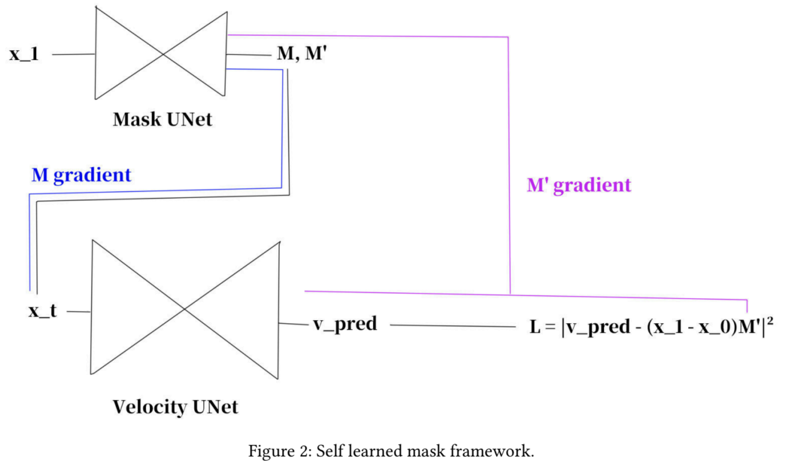

# [Research] Spatially-Varying Flow Matching (SVFM)

**This repository serves as a conceptual overview of a research project undertaken during my internship at the VISTA Lab, École Polytechnique.**

---

### Core Idea

Standard generative models like Denoising Diffusion Models and Flow Matching typically assume a spatially uniform generation process. This project challenges that assumption by introducing **Spatially-Varying Flow Matching (SVFM)**, a framework designed to allow for a more structured and content-aware generation process.

The central mechanism is a dynamic, learned spatial mask (`M_t`) that dictates which parts of an image are generated at which point in time, generalizing the standard Optimal Transport path:

`x_t = x_1 ⊙ M_t + x_0 ⊙ (1 - M_t)`

### Project Status

This research is ongoing.
